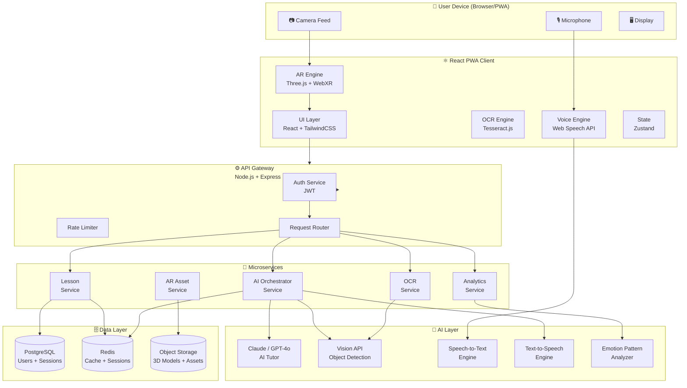
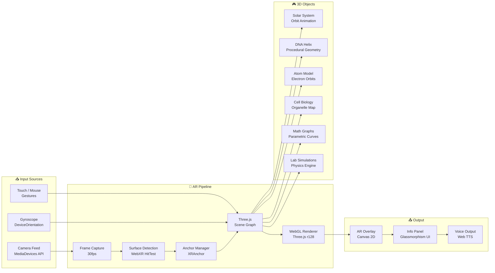
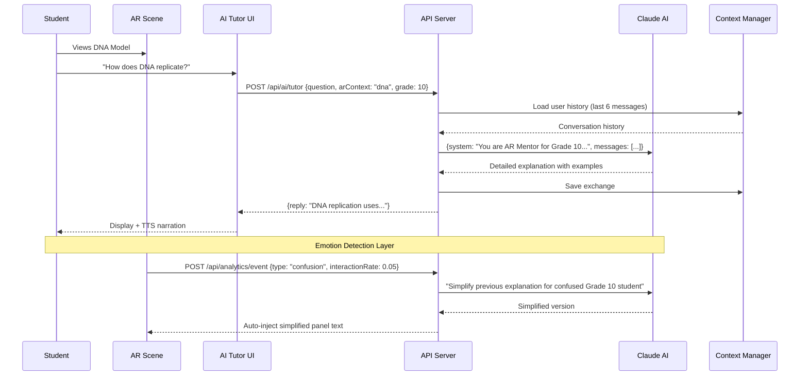
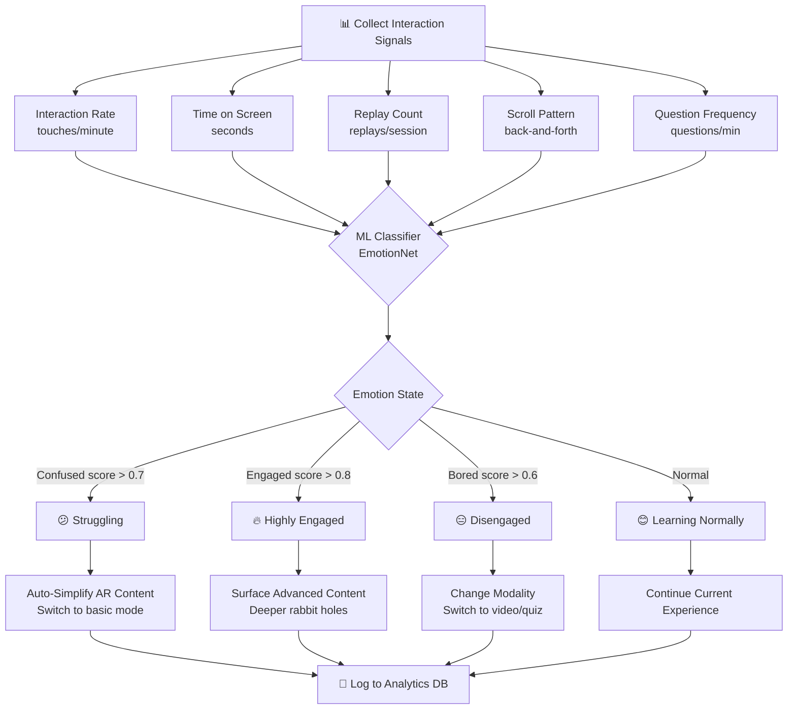
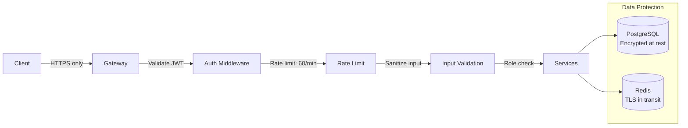
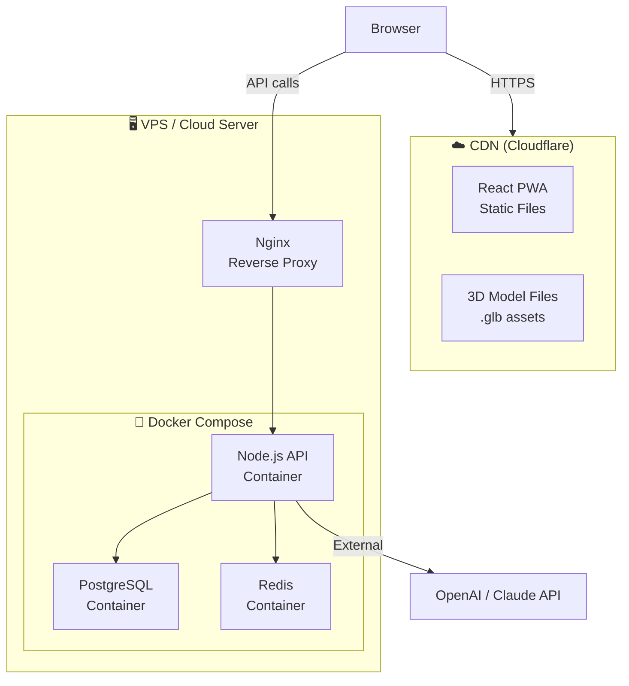

# 🏗️ AR Mentor — System Architecture

## Table of Contents
1. [High-Level Architecture](#1-high-level-architecture)
2. [AR Engine Architecture](#2-ar-engine-architecture)
3. [AI Pipeline Architecture](#3-ai-pipeline-architecture)
4. [OCR Pipeline](#4-ocr-pipeline)
5. [Emotion Detection Engine](#5-emotion-detection-engine)
6. [Database Schema](#6-database-schema)
7. [API Architecture](#7-api-architecture)
8. [State Management](#8-state-management)
9. [Security Architecture](#9-security-architecture)
10. [Deployment Architecture](#10-deployment-architecture)

---

## 1. High-Level Architecture



---

## 2. AR Engine Architecture



---

## 3. AI Pipeline Architecture



---

## 4. OCR Pipeline

```mermaid
graph TD
    A[📷 Capture Image] --> B[Client-side Preprocessing\nGrayscale + Contrast]
    B --> C{File Size Check}
    C -->|< 2MB| D[Tesseract.js\nClient OCR]
    C -->|> 2MB| E[Server OCR\nTesseract + Vision API]
    D --> F[Raw Text Output]
    E --> F
    F --> G[NLP Preprocessing\nStopword Removal]
    G --> H[Concept Extraction\nKeyword + NER]
    H --> I[Subject Classification\nPhysics / Bio / Chem / Math]
    I --> J[AI Enhancement\nGPT-4o: Structure concepts]
    J --> K[AR Config Generation\n3D model selection + annotation]
    K --> L[Return to Client\n{topic, arKey, concepts, summary}]
    L --> M[🚀 Launch AR Scene]
    
    style A fill:#1e3a5f,color:#fff
    style M fill:#1e5f3a,color:#fff
```

---

## 5. Emotion Detection Engine



---

## 6. Database Schema

```sql
-- ── USERS ────────────────────────────────────────────────────
CREATE TABLE users (
    id              UUID PRIMARY KEY DEFAULT gen_random_uuid(),
    email           VARCHAR(255) UNIQUE NOT NULL,
    password_hash   VARCHAR(255) NOT NULL,
    name            VARCHAR(255),
    grade_level     VARCHAR(10),              -- '10', '11', 'UG'
    learning_style  VARCHAR(20),              -- 'visual','auditory','kinesthetic'
    weak_subjects   JSONB DEFAULT '[]',       -- ["Physics","Math"]
    strong_subjects JSONB DEFAULT '[]',
    total_xp        INT DEFAULT 0,
    streak_days     INT DEFAULT 0,
    last_active     TIMESTAMP,
    created_at      TIMESTAMP DEFAULT NOW()
);

-- ── SESSIONS ──────────────────────────────────────────────────
CREATE TABLE learning_sessions (
    id                  UUID PRIMARY KEY DEFAULT gen_random_uuid(),
    user_id             UUID REFERENCES users(id) ON DELETE CASCADE,
    session_type        VARCHAR(30),          -- 'ar_scan','lab','tutor','history','math','career'
    subject             VARCHAR(100),
    topic               VARCHAR(255),
    ar_objects_rendered JSONB,               -- [{model: "dna", duration: 45}]
    duration_seconds    INT DEFAULT 0,
    confusion_events    INT DEFAULT 0,
    comprehension_score FLOAT,              -- 0.0–1.0 from post-session quiz
    started_at          TIMESTAMP,
    ended_at            TIMESTAMP
);

-- ── AR LESSONS (Library) ──────────────────────────────────────
CREATE TABLE ar_lessons (
    id              UUID PRIMARY KEY DEFAULT gen_random_uuid(),
    title           VARCHAR(255) NOT NULL,
    subject         VARCHAR(100),
    grade           VARCHAR(20),
    content_text    TEXT,
    ar_model_key    VARCHAR(100),            -- 'dna','solar','atom'
    three_js_config JSONB,                   -- Full Three.js scene config
    ai_system_prompt TEXT,                   -- Tutor context for this lesson
    difficulty      SMALLINT DEFAULT 2,      -- 1=easy, 2=med, 3=hard
    is_public       BOOLEAN DEFAULT true,
    play_count      INT DEFAULT 0,
    rating          FLOAT DEFAULT 0.0,
    created_by      UUID REFERENCES users(id),
    created_at      TIMESTAMP DEFAULT NOW()
);

-- ── OCR SCANS ─────────────────────────────────────────────────
CREATE TABLE ocr_scans (
    id                  UUID PRIMARY KEY DEFAULT gen_random_uuid(),
    user_id             UUID REFERENCES users(id),
    raw_ocr_text        TEXT,
    extracted_concepts  JSONB,               -- [{concept:"DNA",confidence:0.97}]
    subject_detected    VARCHAR(100),
    ar_overlay_config   JSONB,               -- Generated AR config
    image_hash          VARCHAR(64),          -- SHA-256 for dedup
    processing_ms       INT,
    created_at          TIMESTAMP DEFAULT NOW()
);

-- ── INTERACTION EVENTS (Emotion Engine) ───────────────────────
CREATE TABLE interaction_events (
    id              UUID PRIMARY KEY DEFAULT gen_random_uuid(),
    session_id      UUID REFERENCES learning_sessions(id),
    user_id         UUID REFERENCES users(id),
    event_type      VARCHAR(50),             -- 'confusion','engaged','replay','question','pause'
    context         JSONB,                   -- {ar_model:"dna", time_in_session: 45}
    emotion_score   FLOAT,                   -- Classifier confidence
    triggered_action VARCHAR(100),           -- 'auto_simplify','surface_advanced'
    created_at      TIMESTAMP DEFAULT NOW()
);

-- ── KNOWLEDGE MAP ─────────────────────────────────────────────
CREATE TABLE knowledge_nodes (
    id              UUID PRIMARY KEY DEFAULT gen_random_uuid(),
    user_id         UUID REFERENCES users(id),
    subject         VARCHAR(100),
    topic           VARCHAR(255),
    mastery_level   FLOAT DEFAULT 0.0,       -- 0.0–1.0
    study_minutes   INT DEFAULT 0,
    connections     JSONB DEFAULT '[]',       -- [topic_ids of linked concepts]
    last_studied    TIMESTAMP,
    created_at      TIMESTAMP DEFAULT NOW(),
    UNIQUE(user_id, topic)
);

-- ── TUTOR CONVERSATIONS ───────────────────────────────────────
CREATE TABLE tutor_conversations (
    id              UUID PRIMARY KEY DEFAULT gen_random_uuid(),
    user_id         UUID REFERENCES users(id),
    session_id      UUID REFERENCES learning_sessions(id),
    messages        JSONB DEFAULT '[]',      -- [{role,content,timestamp}]
    topic_context   VARCHAR(255),
    total_messages  INT DEFAULT 0,
    created_at      TIMESTAMP DEFAULT NOW(),
    updated_at      TIMESTAMP DEFAULT NOW()
);

-- ── INDEXES ───────────────────────────────────────────────────
CREATE INDEX idx_sessions_user ON learning_sessions(user_id);
CREATE INDEX idx_events_session ON interaction_events(session_id);
CREATE INDEX idx_nodes_user ON knowledge_nodes(user_id);
CREATE INDEX idx_lessons_subject ON ar_lessons(subject, grade);
CREATE INDEX idx_scans_hash ON ocr_scans(image_hash);
```

---

## 7. API Architecture

### REST Endpoints

```
AUTH
├── POST   /api/auth/register          # {name, email, password, grade}
├── POST   /api/auth/login             # {email, password} → JWT
├── GET    /api/auth/me                # Get current user profile
└── POST   /api/auth/refresh           # Refresh JWT token

AI TUTOR
├── POST   /api/ai/tutor               # {question, arContext, history[]}
├── POST   /api/ai/explain             # {topic, grade, depth: simple|normal|advanced}
├── POST   /api/ai/generate-lesson     # {topic, grade} → AR lesson config
├── GET    /api/ai/career/:career      # Get career AR simulation script
└── POST   /api/ai/object-identify     # {imageBase64} → {object, arConfig}

OCR
├── POST   /api/ocr/scan               # multipart: image → {concepts, arConfig}
└── GET    /api/ocr/history            # User's scan history

LESSONS
├── GET    /api/lessons                # List: ?subject=&grade=&page=
├── GET    /api/lessons/:id            # Single lesson with 3D config
├── POST   /api/lessons                # Create custom lesson
├── POST   /api/lessons/:id/complete   # Mark completed, update mastery
└── GET    /api/lessons/recommended    # AI-personalized recommendations

ANALYTICS
├── POST   /api/analytics/event        # Log interaction event
├── GET    /api/analytics/me           # User dashboard stats
├── GET    /api/analytics/knowledge-map # {nodes, connections, mastery}
└── GET    /api/analytics/weak-areas   # AI-identified improvement areas

AR ASSETS
├── GET    /api/ar/models              # List available 3D model configs
└── GET    /api/ar/models/:key         # Three.js config for topic key
```

### Response Formats

```typescript
// POST /api/ai/tutor
interface TutorResponse {
  reply: string;
  confidence: number;
  suggestedFollowUps: string[];
  emotionAdaptation?: 'simplified' | 'advanced' | null;
  relatedARModel?: string;
}

// POST /api/ocr/scan
interface OCRResponse {
  rawText: string;
  concepts: Array<{ name: string; confidence: number; category: string }>;
  subject: string;
  arModelKey: string;
  aiSummary: string;
  difficulty: 1 | 2 | 3;
}

// GET /api/analytics/knowledge-map
interface KnowledgeMapResponse {
  nodes: Array<{
    id: string; topic: string; subject: string;
    mastery: number; x: number; y: number; z: number;
  }>;
  connections: Array<{ source: string; target: string; strength: number }>;
  weakAreas: string[];
  suggestedNext: string;
}
```

---

## 8. State Management (Zustand)

```typescript
interface AppState {
  // User
  user: User | null;
  grade: string;
  subjects: string[];

  // AR
  currentARTopic: string | null;
  arMode: 'scan' | 'lab' | 'history' | 'math' | 'career' | null;
  explodeMode: boolean;
  voiceActive: boolean;

  // Session
  sessionId: string | null;
  sessionStartTime: number | null;
  confusionEvents: number;
  interactionCount: number;

  // Tutor
  tutorHistory: Message[];
  tutorOpen: boolean;

  // Actions
  setGrade: (g: string) => void;
  launchAR: (topic: string) => void;
  closeAR: () => void;
  logInteraction: (type: string) => void;
  sendTutorMessage: (msg: string) => Promise<void>;
}
```

---

## 9. Security Architecture



**Security measures:**
- All API calls over HTTPS/TLS 1.3
- JWT with 15-minute expiry + refresh tokens
- Rate limiting: 60 req/min per user, 10 AI calls/min
- Input sanitization on all text fields
- API keys server-side only (never exposed to client)
- Image uploads: type validation + size limit (5MB)
- Content Security Policy headers

---

## 10. Deployment Architecture


